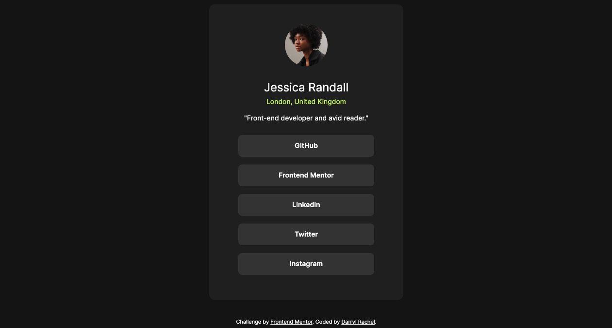

# fm-social-links-profile

This is a solution to the [Social links profile challenge on Frontend Mentor](https://www.frontendmentor.io/challenges/social-links-profile-UG32l9m6dQ). 

## Table of contents

- [Overview](#overview)
  - [The challenge](#the-challenge)
  - [Screenshot](#screenshot)
  - [Links](#links)
- [My process](#my-process)
  - [Built with](#built-with)
  - [What I learned](#what-i-learned)
  - [Continued development](#continued-development)
  - [Useful resources](#useful-resources)
- [Author](#author)

## Overview

### The challenge

Users should be able to:

- See hover and focus states for all interactive elements on the page

### Screenshot



### Links

- Solution URL: https://github.com/darrylrachel/fm-social-links-profile
- Live Site URL: https://project-social-links-profile.netlify.app/

## My process

### Built with

- Semantic HTML5 markup
- Scss
- Flexbox

### What I learned

During this project I learned how to use gap with flexbox. I found it to be very easy to use and convenient.

```css
.main__container--cards {
  display: flex;
  gap: 1rem;
  flex-direction: column;
  margin-top: 1.75rem;
}
```

### Continued development

After learning about the gap property I will work on getting more familiar with all that flexbox and grid has to offer.

### Useful resources

- [CSS-Tricks](https://css-tricks.com/almanac/properties/g/gap/) - This helped me learn more about the gap property. I really liked this resource because It was clear and straight forward.

## Author

- Website - Darryl Rachel https://trbllabs.com/
- Frontend Mentor - @darrylrachel https://www.frontendmentor.io/profile/darrylrachel
- Twitter - @darryldevydev (https://www.twitter.com/darryldevydev)
